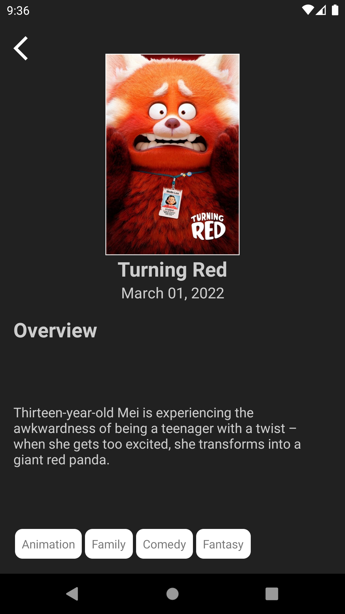
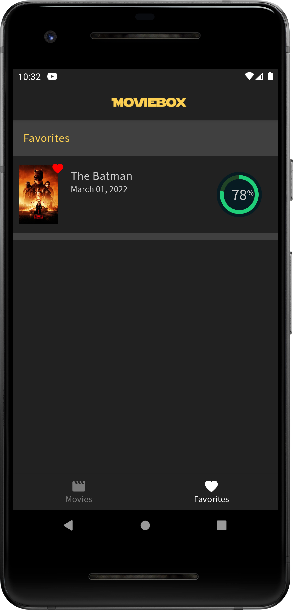
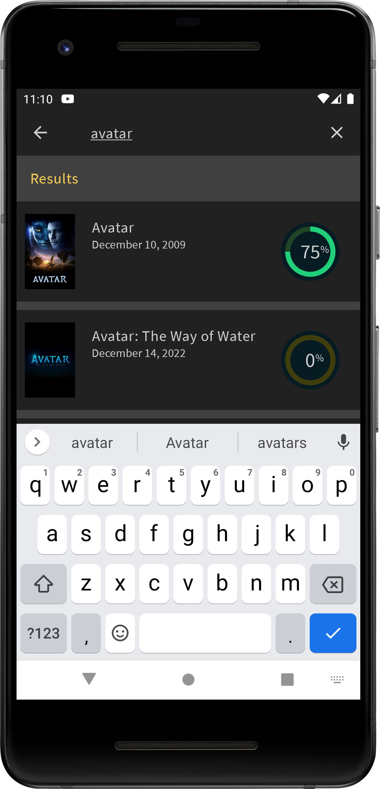
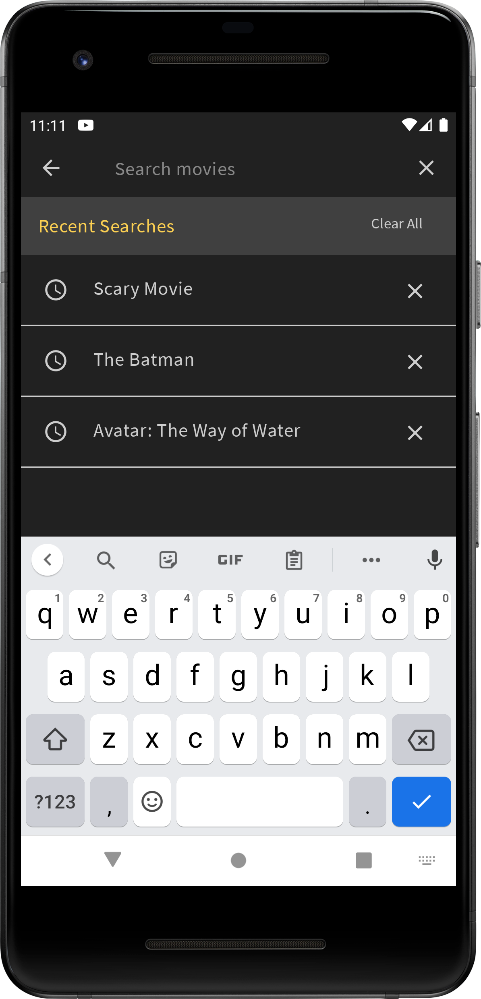
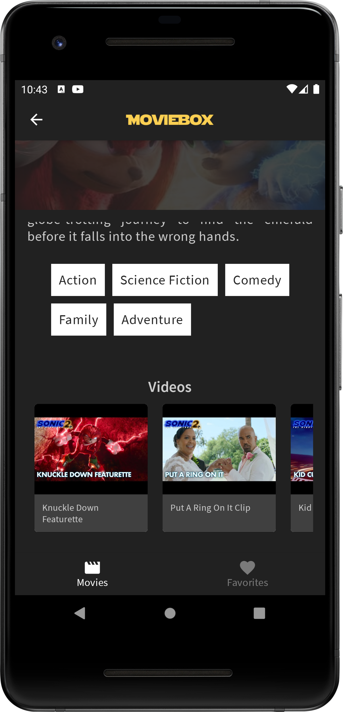
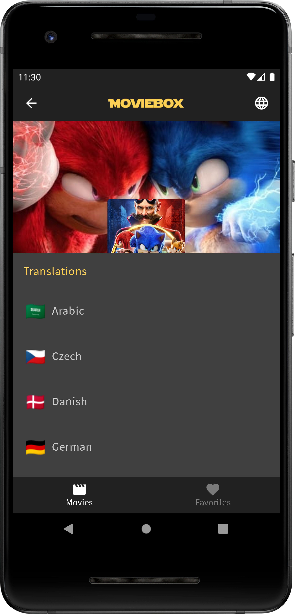
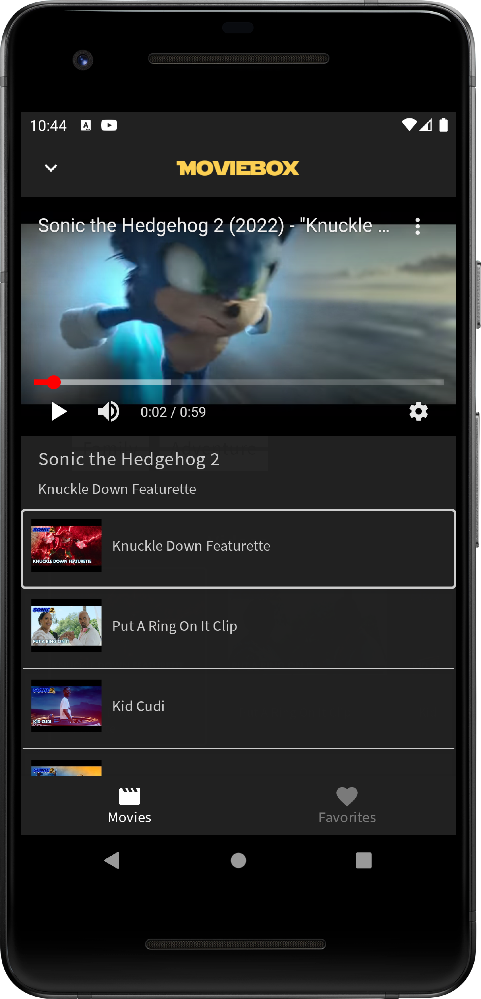
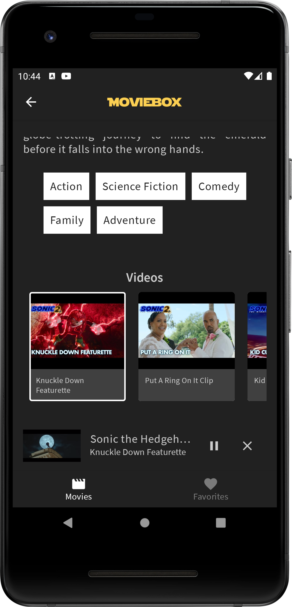

# android.anibalbastias.moviesapp

## Movies App Code Challenge

[](https://kotlinlang.org)
[](https://developer.android.com/studio/releases/gradle-plugin)
[](https://gradle.org)

The goal of this application is get Movie data from TheMovie DB API for show the "Now Playing" in a
horizontal list and "Popular" endless vertical list. Also, pressing any item, you can see the
details of the movie.

This project is being maintained to match current industry standards.

# Motivation

In my previous job I supported, coached and guided many junior consultants to carry out quality Android Code challenges. This is why I was inspired by one in particular and took the opportunity to catch up with Jetpack Compose and the other Jetpack Libraries to improve my skills in Android Development.
Also, I took advantage of applying some knowledge (from previous jobs) of good practices, design patterns, clean architectures, testing, modularization and git submodules.

And lastly, create a Compose component library using Atomic Design, to maintain a structural and elegant design pattern.

## Description


* UI
   * [Compose](https://developer.android.com/jetpack/compose) declarative UI framework
   * [Material design](https://material.io/design)

* Tech/Tools
    * [Kotlin](https://kotlinlang.org/) 100% coverage
    * [Coroutines](https://kotlinlang.org/docs/reference/coroutines-overview.html) and [Flow](https://developer.android.com/kotlin/flow) for async operations
    * [Hilt](https://developer.android.com/training/dependency-injection/hilt-android) for dependency injection
    * [Jetpack](https://developer.android.com/jetpack)
        * [Compose](https://developer.android.com/jetpack/compose)
        * [Navigation](https://developer.android.com/topic/libraries/architecture/navigation/) for navigation between composables
        * [ViewModel](https://developer.android.com/topic/libraries/architecture/viewmodel) that stores, exposes and manages UI state
    * [Retrofit](https://square.github.io/retrofit/) for networking
    * [Landscapist Glide](https://github.com/skydoves/landscapist) for image loading

* Modern Architecture
    * Single activity architecture (with [Navigation component](https://developer.android.com/guide/navigation/navigation-getting-started)) that defines navigation graphs
    * MVVM for presentation layer
    * [Android Architecture components](https://developer.android.com/topic/libraries/architecture) ([ViewModel](https://developer.android.com/topic/libraries/architecture/viewmodel), [Navigation](https://developer.android.com/jetpack/androidx/releases/navigation))
    * [Android KTX](https://developer.android.com/kotlin/ktx) - Jetpack Kotlin extensions

# Architecture

* This project was developed using CLEAN Architecture and MVVM (Model View ViewModel) with some
  approaches from MVI (Model View Intent).
* The architecture contains the following features:
    * data:
        * remote: Using Retrofit (REST API) and OkHttp (Security and interceptors)
            * Now Playing Movies: Just consuming REST API without caching.
            * Popular: Consuming REST API using pagination with cache. Also, using Paging library
              with synchronization with Retrofit and Room DB
            * Repository for link to the domain layer
        * local: Using Room DB
            * Logic for create the RoomDB Instance, Entities and Daos.
            * Repository for link to the domain layer

    * domain: Intermediate layer between data and presentation, for have the business logic using
      agnostic use cases for connect to the ViewModels.

    * presentation: This contains the Ui Models (Only needed for the UI) using mappers, and the
      ViewModels

    * ui: Using Landscapist Glide library for load images smoothly.
        * list: Contains 2 view components: Now Playing and Popular. Each one have own list for
          that.
        * detail: Simple fragment showing the detail data.

    * di: Means about using Dependency Injection using Dagger Hilt, separating the scopes for any
      layer and the ViewModel.


# Screenshots

<p float="left">









</p>

# Testing

This project have 3 kind of tests:

* Unit Tests: Using JUnit 4 and Mockito for check the business logic for ViewModels, 
repositories, models.

* Instrumentation Tests: Using MockWebServer for check the response of the REST API.

* UI Tests: Using Espresso for check the navigation.

# Extra functionalities

* Swipe Refresh Layout in the list
* ic_launcher for Movies logo
* Extra security layer for sensitive data
* Certification Pinning
* Favorite movies
* Swipe to add favorite
* Search movies
* Recent searches
* Expandable/Collapsable Toolbar in detail screen
* YouTube expandable screen + VieModel lifecycle handling
* Translations in realtime
```
openssl s_client -connect api.themoviedb.org:443 | openssl x509 -pubkey -noout | openssl rsa -pubin -outform der | openssl dgst -sha256 -binary | openssl enc -base64
```
* Splash Screen API from Jetpack

# Approaches
## Both approaches are using the same architecture, with different
Ui frameworks

* `feature/xml-approach`: Using ViewBinding with XML Custom Views and LiveData.
* `feature/compose-approach`: Using Jetpack Compose with SharedFlow
